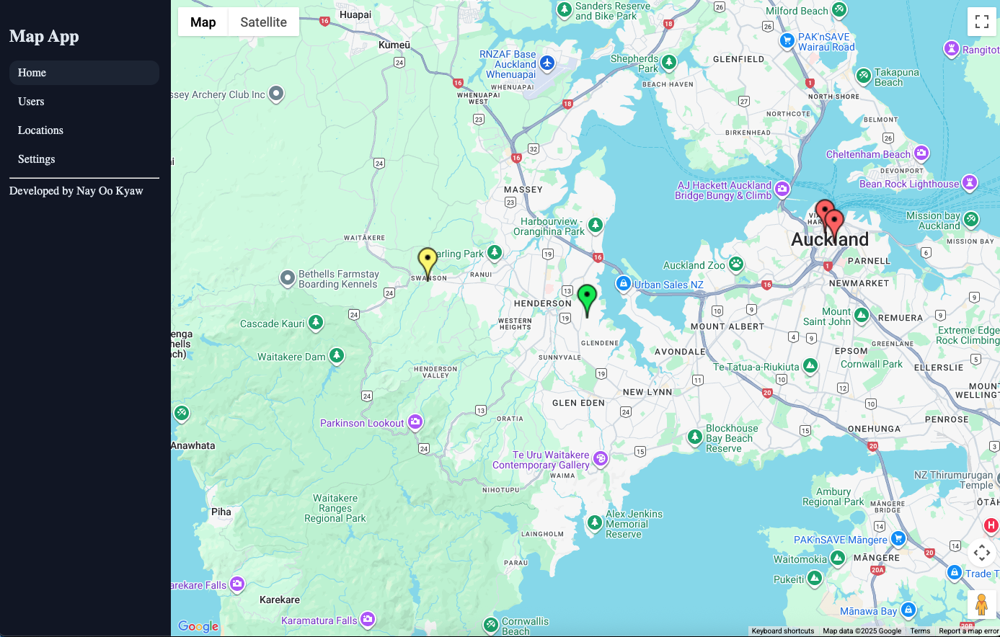
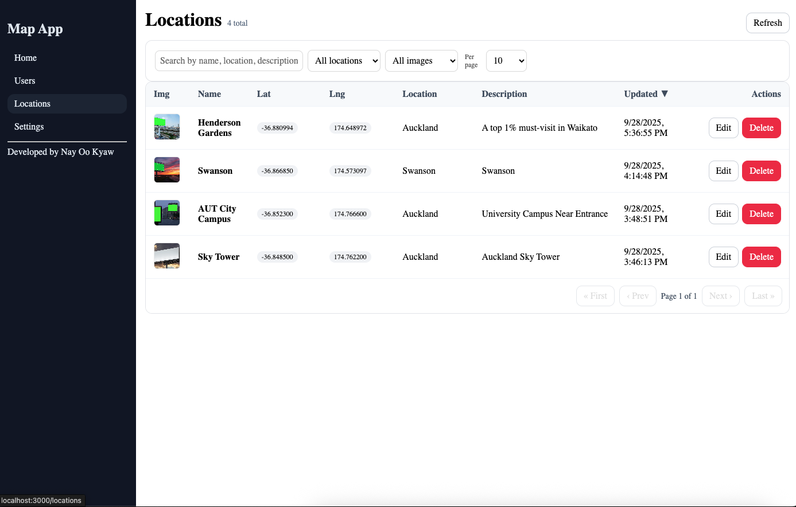
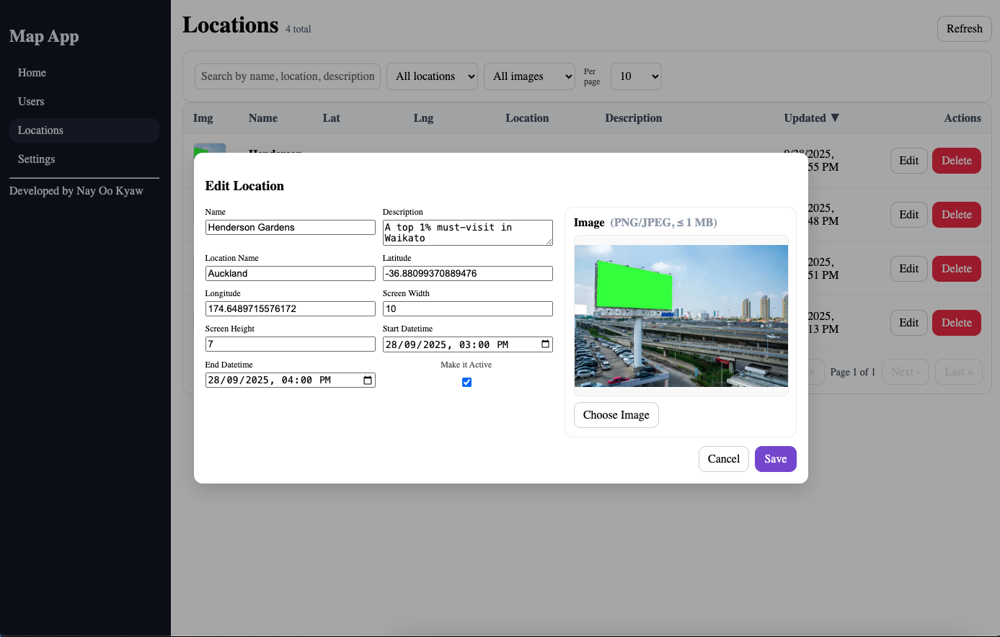
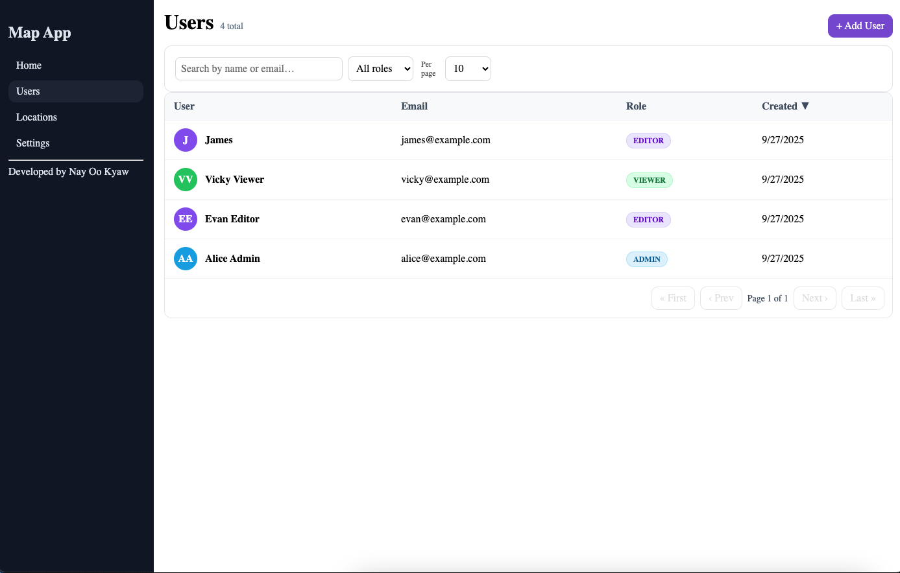
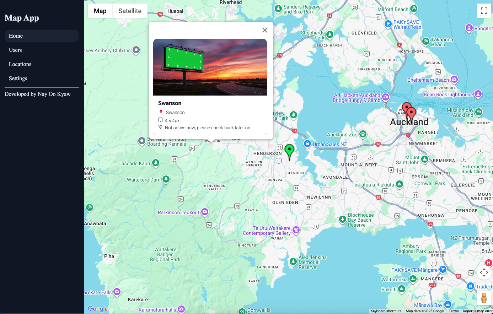
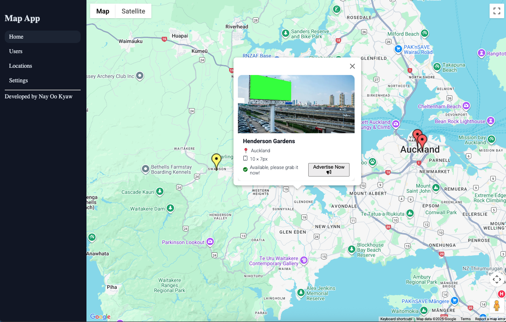
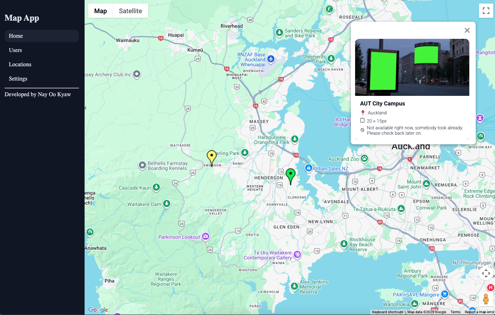
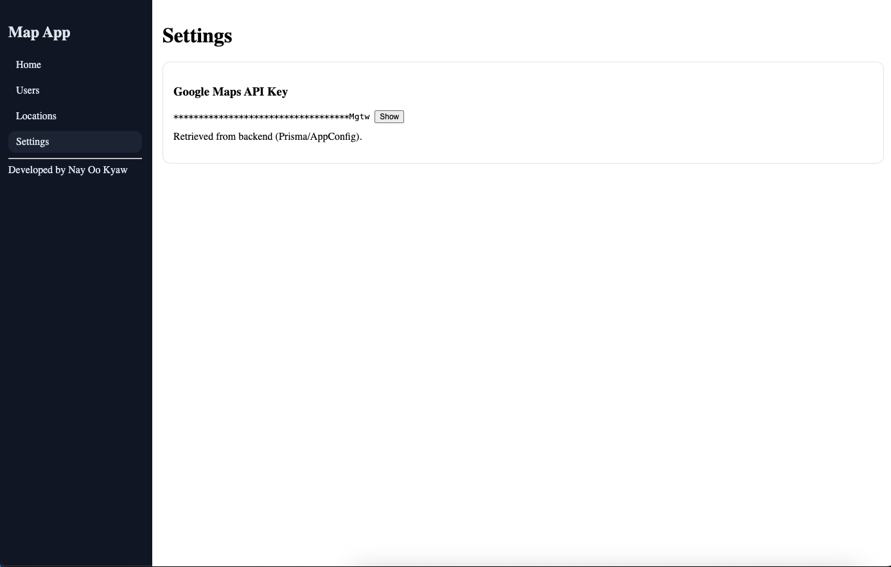

    Developer - Nay Oo Kyaw
    Email - nayookyaw.nok@gmail.com

# Google Map with Contents Reactjs and NodeJs Typescript Jest Unit Testing
* Project Details
    This project is the dashboard that end-user is able to manage the location on google map
    Able to manage (add/edit/delete) users
    Able to add new location on the map by clicking on specific location on the map
    Able to manage location details such as name, description, image, start/end datetime and active status

# Result Outcome Dashboard Console

# 1) Start MySQL
docker compose up -d

# 2) Backend
cd backend-nodejs  
cp .env.sample .env           # set DATABASE_URL & GOOGLE_MAPS_API_KEY  
npm install  
npx prisma validate  
npx prisma migrate dev --name init  

# ensure DATABASE_URL and (optionally) GOOGLE_MAPS_API_KEY in .env
npx prisma generate  
npm run seed  
# or to rebuild db + re-seed:
npm run db:reset  

npm run dev                   # http://localhost:4000  

# migrate the new columns
npx prisma migrate dev --name name_of_description  
npx prisma migrate deploy  

npx prisma migrate status  

# 3) Frontend
cd frontend-reactjs
cp .env.sample .env           # REACT_APP_API_BASE_URL=http://localhost:4000  
npm install  
npm start                     # http://localhost:3000  
